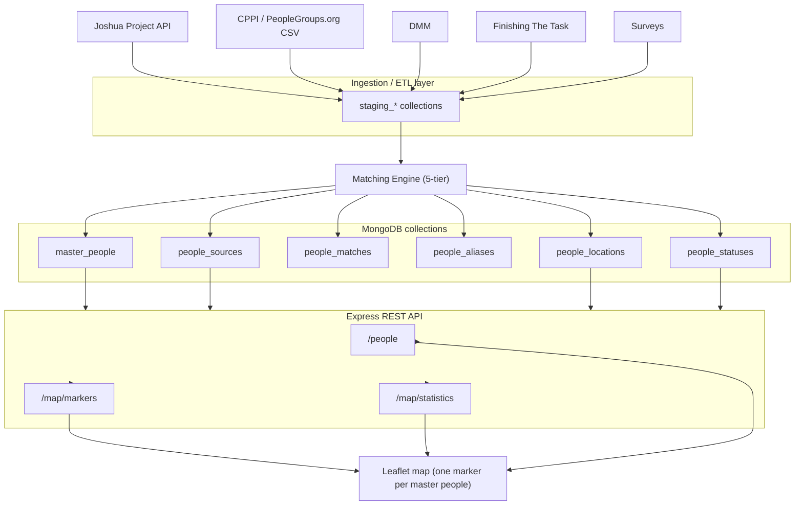
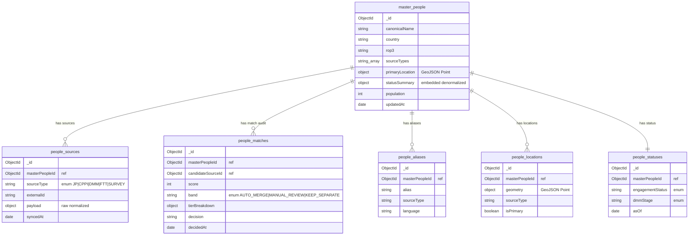
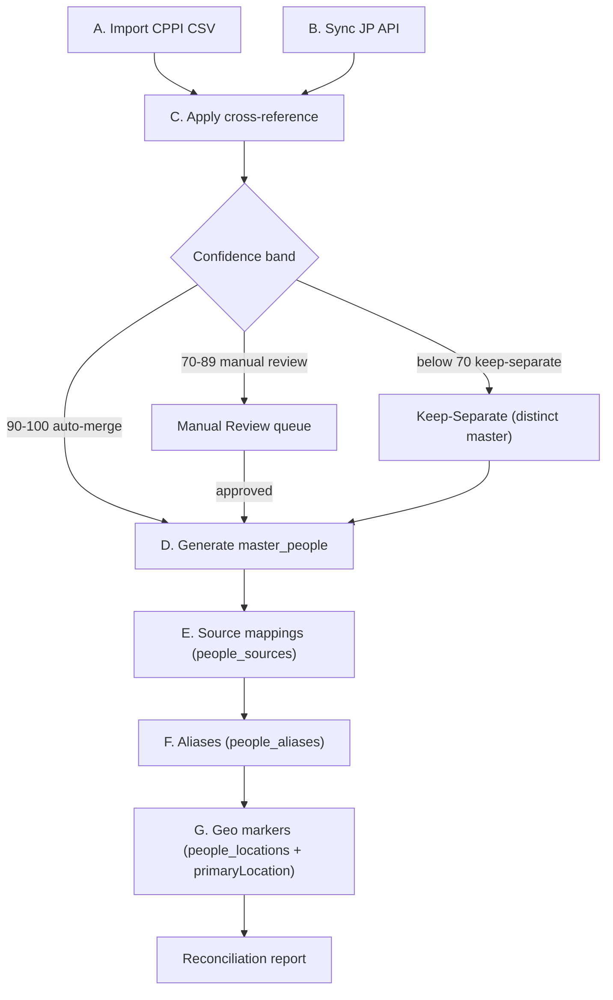
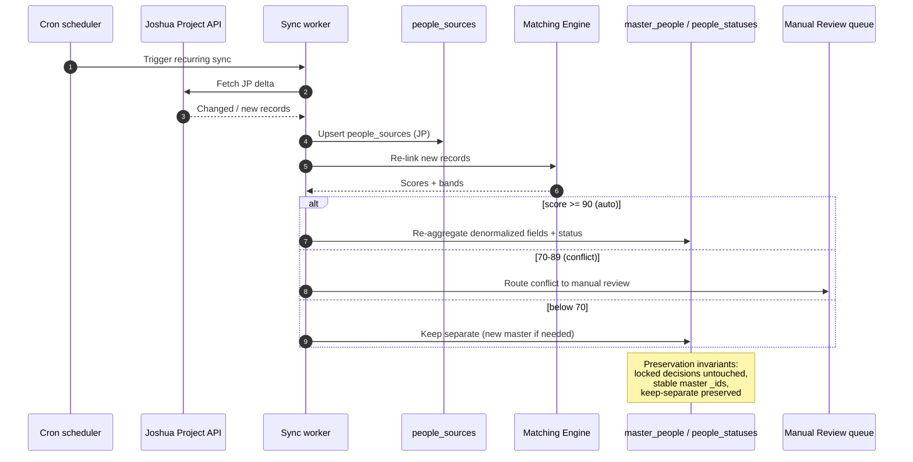
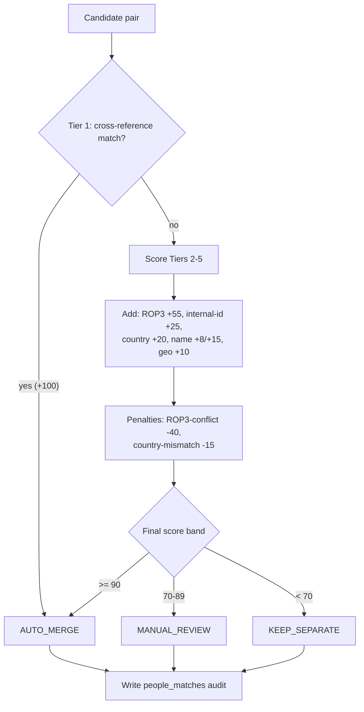
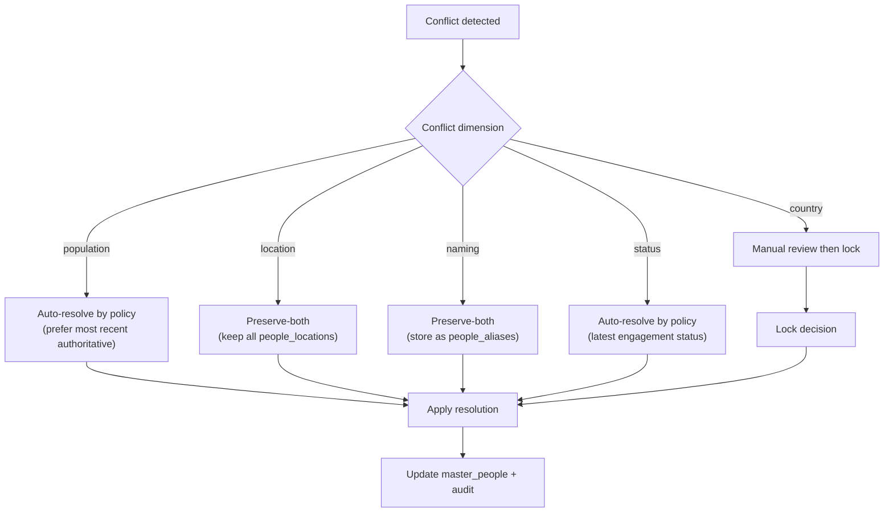
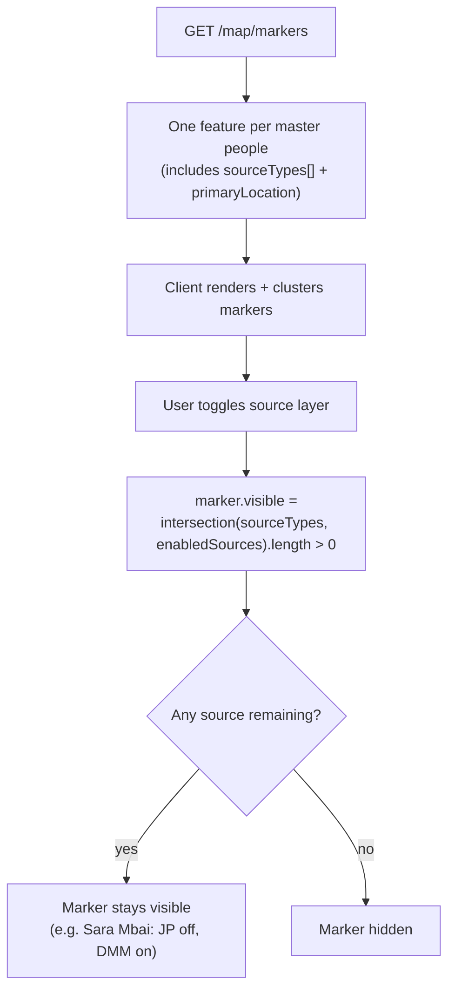
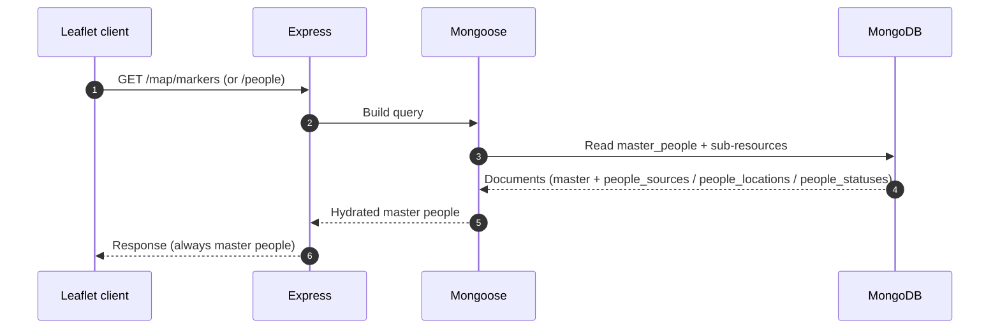

# Step 10 — Implementation Artifacts

This document consolidates the full MongoDB-first design from Steps 1–9 into a single set of diagrams and workflow visuals. Everything anchors on **six MongoDB collections**: `master_people`, `people_sources`, `people_matches`, `people_aliases`, `people_locations`, and `people_statuses`. The `master_people` document carries denormalized fields for fast reads — `sourceTypes[]`, a `primaryLocation` GeoJSON `Point`, and an embedded status summary — so the map and API can serve one record per people group without fan-out queries.

Confidence bands govern how candidate records are reconciled:

- **90–100 → auto-merge** (records are combined into one master people)
- **70–89 → manual review** (queued for a human decision)
- **0–69 → keep-separate** (records remain distinct)

All GitHub-flavored Mermaid blocks below use ` ```mermaid ` fences and render natively on GitHub.

---

## 1. High-level architecture diagram

External source feeds are normalized by the ingestion/ETL layer into `staging_*` collections, run through the 5-tier matching engine, and persisted into the six canonical collections. The Express REST API reads exclusively from `master_people` and its sub-resources, and the Leaflet client renders exactly one marker per master people.



---

## 2. ER diagram (MongoDB collections)

The diagram below models the six collections with representative fields and types. MongoDB is a document database, so these relationships are **ObjectId references, not foreign keys** — cardinality is enforced by the application layer and the matching engine, not by the database. `master_people` is the aggregate root; sub-resources reference it via `masterPeopleId`.



---

## 3. Migration workflow (Phases A–G)

The one-time migration bootstraps the data model from historical sources. Phases A and B feed the cross-reference step (C), which drives master creation (D) and the derived sub-resources (E–G). Candidates scoring 70–89 branch to the manual review queue; anything below 70 is kept separate. A reconciliation report closes out the run.



---

## 4. Synchronization workflow

The recurring Joshua Project sync keeps the model current without disturbing manually reviewed decisions. New or changed JP records are upserted into `people_sources`, re-linked via the matching engine, and the denormalized master fields plus `people_statuses` are re-aggregated. Conflicts route to manual review. **Preservation invariants:** locked/manual decisions are never overwritten, keep-separate records stay separate, and existing `master_people` `_id`s are stable across syncs.



---

## 5. Merge / matching workflow

The 5-tier engine short-circuits on a Tier 1 cross-reference hit (+100 → auto-merge). Otherwise it accumulates a weighted score across Tiers 2–5, applies penalties, bands the result, and writes a `people_matches` audit record capturing the tier breakdown and final decision.



---

## 6. Conflict-resolution workflow

Five conflict dimensions — population, location, naming, country, and status — are each routed by policy to one of three outcomes: auto-resolve, preserve-both, or manual-review-then-lock. Locking prevents subsequent syncs from re-triggering the same conflict.



---

## 7. Map rendering & source-visibility workflow

`GET /map/markers` returns exactly one GeoJSON feature per master people. The client renders and clusters those features. When a user toggles a source layer, each marker's visibility is computed as the intersection of the master's `sourceTypes[]` with the enabled sources — the marker stays visible as long as **any** of its sources remains enabled. (Example: *Sara Mbai* has both JP and DMM sources; disabling JP alone keeps her marker on the map.)



---

## 8. API request flow

A read request flows from the Leaflet client through Express, into Mongoose, and out to MongoDB. Queries hit `master_people` plus its sub-resources, and the response is always shaped as master people records — sub-resources are embedded or joined server-side so clients never reassemble fragments.



---

## 9. Deliverables checklist

The table below summarizes the artifacts produced across the series and links to the sibling documents that specify each in detail.

| Artifact | Description | Reference doc |
| --- | --- | --- |
| Data analysis | Source-field inventory across all feeds | [01-data-analysis.md](./01-data-analysis.md) |
| Master people model | Aggregate-root design + denormalized fields | [02-master-people-model.md](./02-master-people-model.md) |
| Merge algorithm | 5-tier scoring, penalties, confidence bands | [03-merge-algorithm.md](./03-merge-algorithm.md) |
| MongoDB schemas + indexes | Six-collection schemas, GeoJSON `2dsphere`, index plan | [04-mongodb-schemas.md](./04-mongodb-schemas.md) |
| Migration workflows | Phases A–G, reconciliation report | [05-migration-workflows.md](./05-migration-workflows.md) |
| Synchronization | Recurring JP sync + preservation invariants | [06-synchronization.md](./06-synchronization.md) |
| Map architecture | Marker model + source-visibility rules | [07-map-architecture.md](./07-map-architecture.md) |
| API architecture | REST endpoints returning master people | [08-api-architecture.md](./08-api-architecture.md) |
| Conflict resolution | Five dimensions → resolve / preserve / lock | [09-conflict-resolution.md](./09-conflict-resolution.md) |
| ER diagram | Six collections + ObjectId relationships | *this document (Section 2)* |
| Migration / sync / merge / conflict / map / API workflow diagrams | Consolidated Mermaid visuals | *this document (Sections 1, 3–8)* |

**Diagram deliverables in this document**

- [x] High-level architecture diagram (Section 1)
- [x] ER diagram of the six MongoDB collections (Section 2)
- [x] Migration workflow, Phases A–G (Section 3)
- [x] Synchronization workflow (Section 4)
- [x] Merge / matching workflow (Section 5)
- [x] Conflict-resolution workflow (Section 6)
- [x] Map rendering & source-visibility workflow (Section 7)
- [x] API request flow (Section 8)
- [x] Deliverables checklist (Section 9)
